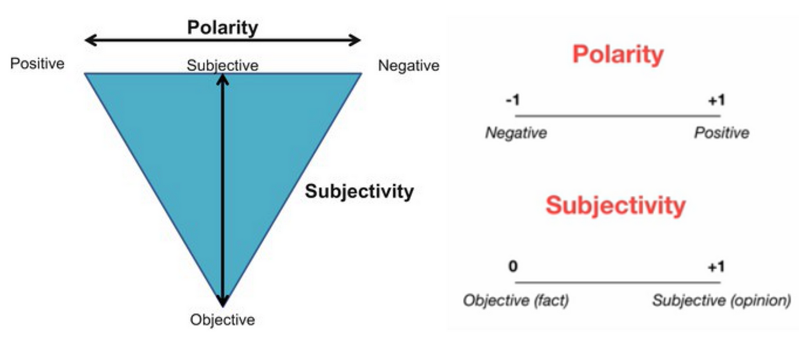

# Sentiment analysis using TextBlob package

TextBlob is a package that provides a simple API for diving into common natural language processing (NLP) tasks such as part-of-speech tagging, noun phrase extraction, sentiment analysis, classification, translation, and more. You can read more about TextBlob [here](https://textblob.readthedocs.io/en/dev/). 

One that we will be using is the sentiment analysis feature, which returns polarity and subjectivity. The polarity score is a float within the range [-1.0, 1.0] where -1.0 is very negative and 1.0 is very positive. The subjectivity score is a float within the range [0.0, 1.0] where 0.0 is very objective and 1.0 is very subjective. You can read more about the sentiment analysis feature [here](https://textblob.readthedocs.io/en/dev/quickstart.html#sentiment-analysis).

