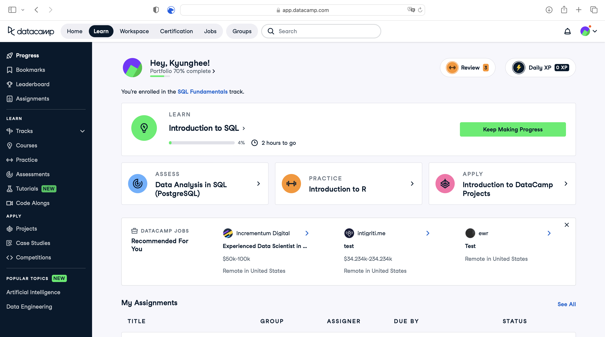

This course will use cloud-based tools to run Python code. There is no need to install any software on your computer. You can access the tools through the links in each module or through your dashboard. Please follow the instructions below to get started.

<!-- ## Google Colab
For this course, we'll be using Google Colab to run Python code. Colab is a free cloud service that provides a Jupyter notebook environment. It allows you to write and execute Python code in your browser, with no setup required. You can also share your notebooks with others and collaborate in real time. 

:::{hint} Google Colab
* You will need a Google account to use Colab.

* This badge  will appear throughout the course. Click on it to open the notebook in Colab.
::: -->

## EdStem
For this course, we'll be using EdStem to run Python code. EdStem is a cloud service that provides a Jupyter notebook environment, which allows you to write and execute Python code in your browser, with no setup required. It is also an online learning platform that allows you to submit your work and receive feedback from the instructor. You can also use EdStem to ask questions and discuss course materials with your classmates. 

:::{hint} How-to
* This badge  will appear throughout the course. Click on it to open the notebook in EdStem.

* You have already been added to the course on EdStem. Use your McGill email address to sign in.

:::

## DataCamp
DataCamp is an online learning platform that offers interactive courses in Python, R, SQL, and other data science tools. The platform is designed to help students learn by doing, with hands-on exercises and projects that are immediately applicable to real-world problems. We'll be using DataCamp to complete the take-home exercises. 

:::{hint} How-to
* Use [this link][datacamp signup link] to sign up for DataCamp. **The link is unique to this section only.**
* You must use your **@mail.mcgill.ca** email address to sign up.

* You can access the exercises through the links in each module () or through your DataCamp dashboard. 

:::

:::{hint} DataCamp Dashboard
:class: dropdown

* `Progress` on the sidebar to overview your progress
* `Assignments` for more detail on the exercises including due dates

:::

[datacamp signup link]: https://www.datacamp.com/groups/shared_links/a5cadcb59af06723e745ce45b5aba0da39e8d56cd6d00747d23a2a4a0af760d2